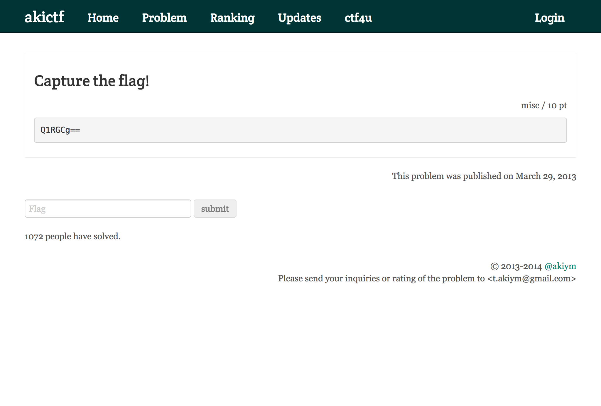

# 「みんなでCTFにトライしてみる！」 第33回山陰ITPro勉強会 開催レポート

2017年4月29日、第33回 山陰ITpro勉強会を開催しました。今回のテーマは 「みんなでCTFにトライしてみる！」 。今回は講師の発表を聞くのではなく、参加者のみなさんがパソコンを持ち込んでインターネット上で公開されている常設CTFサーバの問題を解くという、全員参加型の手を動かすスタイルでした。

ゴールデンウィーク初日にもかかわらず、スタッフ含めて12人に参加いただきました。そのうち半分近くがCTFへのトライは初めてでした。

## CTFとは

CTF（Capture The Flag）とは、コンピューターセキュリティの技術の競技です。出題される問題を日本では日本ネットワークセキュリティ協会が主催するSECCONが有名です。

コンテストのほか、インターネット上にはいつでも問題を解いてみることができる常設CTFサーバが設置されています。今回のSITWでは、参加者が [ksncft](http://ksnctf.sweetduet.info/) と [akictf](http://ctf.katsudon.org) の2つの常設CTFサーバにチャレンジしました。

# 常設CTFにトライ

勉強会開始の15分後から、早速参加者がCTFにトライし始めました。

勉強会の参加募集ページでは「一人で黙々とやってもよし、2,3人で一緒に取り組んでもよし」と案内していたのですが、全員が1人で解き始めました。普段の勉強会とはうってかわってすごく静かで、時折参加者同士の会話が聞こえてくるほかは、聞こえるのはキーを叩く音だけでした。

ちなみに、本物のCTFの会場はこんなに静かではなく、集中を妨げるために大音量で音楽が流れたり動画が放映されたりするそうです。

## 解説タイム

2時間少々取り組んだ後は問題をいくつかピックアップして、解けた人に解説をしてもらいました。

問題文の中に隠れていることがあるヒントや、Webページのソースコードを参照して見つけた違和感をきっかけに、知識を総動員しながらさまざまなことを試して解答を導いているのが印象的でした。

問題の中には、ソフトウェア開発のときにうっかり作り込んでしまうことがある脆弱性を利用したものもあり、CTFにはコンピュータの教育にも大変有効だと感じました。

