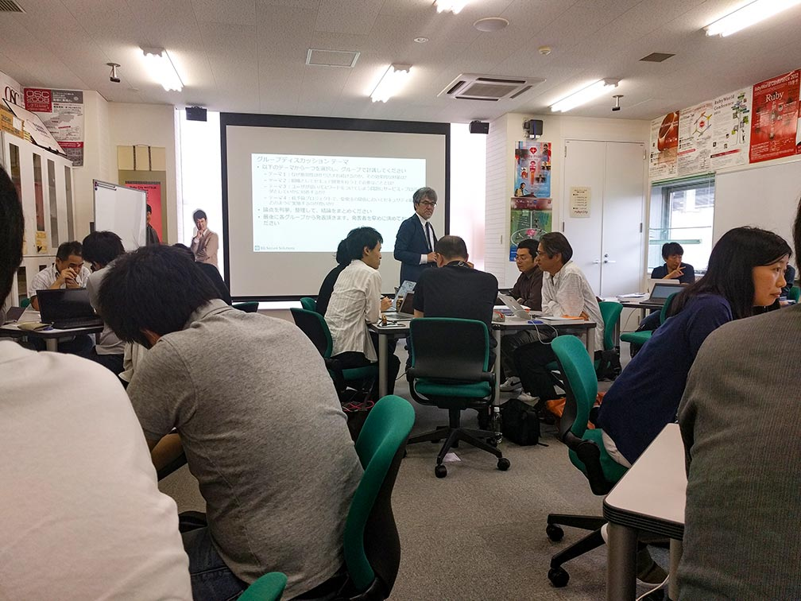

# 「徳丸本の歩き方」 第35回山陰ITPro勉強会 開催レポート

2018年7月7日、第35回 山陰ITpro勉強会を開催しました。今回はWebアプリケーションセキュリティの第一人者である[EGセキュアソリューションズ株式会社](https://www.eg-secure.co.jp/) 代表取締役 [徳丸浩様](https://twitter.com/ockeghem)にお越しいただき、6/21に発売された[「体系的に学ぶ 安全なWebアプリケーションの作り方 第2版」](https://www.eg-secure.co.jp/wasbook/)の発刊を記念して同書の話題などを講演いただきました。

初版の「体系的に学ぶ 安全なWebアプリケーションの作り方」は、タイトル通り体系立てられた内容とわかりやすいサンプルなどによりWebアプリケーションにおけるセキュリティ対策のバイブル的な存在の本として有名です。同書は「徳丸本」とも呼ばれています。

当日は西日本豪雨の影響でSITW開始以来初めての10名を超えるキャンセルがあり、スタッフを含めて24人の参加となりました。

- 参考) [第35回山陰ITpro勉強会のまとめ - Togetter](https://togetter.com/li/1245071)

## 講演

- タイトル: 体系的に学ぶ安全なWebアプリケーションの作り方 第2版 脆弱性が生まれる原理と対策の実践について
- 講演者: 徳丸浩様 (EGセキュアソリューションズ株式会社) 代表取締役)

「徳丸本の歩き方」を講演いただきました。

### 各章の読み進め方

「徳丸本」の以下の章について、お薦めの読み方をお話しいただきました。

- 3章 Webセキュリティの基礎
  - できれば実際に手を動かして読み進めてください。
- 4章 Web アプリケーションの機能別に見るセキュリティバグ
  - 脆弱性の事典のように使ってください。
  (例えば、具体的な脆弱性を解説する「4.3.1 クロスサイトスクリプティング(基本編)」以降は各セクション最初の概要のみを通読した後に、必要な節から手を動かしながら読み進める。)
- 7章 脆弱性診断入門
  - ぜひ手を動かして診断体験をしてみてください

### デモ

書籍の実習用に公開されている仮想マシンを使って、書籍で説明されている脆弱性(クリックジャッキングとCSRF)を再現するデモを実演いただきました。どのように脆弱性が入り込むか実際に見ることができました。

再現する脆弱性だけを取り込んだサンプルを作るため、本を書く以上に実習環境の作成が大変とのことでした。

### 第2版で増えた内容、マイナー変更と消えた内容

第2版で増えた内容、マイナー変更と消えた内容を紹介いただきました。

#### 増えた内容

- CORS(Cross-Origin Resource Sharing)
- クリックジャッキング
- ファイルアップロード(PDFのFormCalc)
- 構造化データの読込にまつわる問題
- キャッシュからの情報漏えい
- Web APIにまつわる問題
- JavaScriptの問題
- 脆弱性診断入門

#### マイナー変更

- ファイルアップロードフォームでのCSRF
- OSコマンドに環境変数でパラメータを渡す
- ログインフォーム（ID、パスワードの二段階入力
- アジャイル開発へのセキュアプログラミングの適用

#### 消えた内容

- 画像ファイルのダウンロードによるXSS
- 携帯電話向けWebアプリの脆弱性対策

## グループディスカッション

徳丸様からテーマをいただいて参加者全員によるグループディスカッションを行いました。
参加者5,6人のグループごとにテーマを選びグループの代表者にディスカッションの内容を発表いただきました。

- ディスカッションテーマ
1. なぜ脆弱性は作り込まれ続けるのか。その効果的な対策は？
2. 組織としてセキュアな開発を行う上で必要なこととは？
3. ユーザが弱いパスワードをつけてしまう問題にサービス・プロバイダとしていかに対処するか？
4. 低予算プロジェクトで、受発注の関係においてセキュリティ施策をどのように実施するのが良いか？

## 最後に

講演で徳丸様が「脆弱性についてミクロとマクロと両方の視点が大事であるが、ディテールを知らないと脆弱性に対処できない。だから脆弱性の個別各論が大切である。」と説明されていたのが印象に残りました。

「徳丸本」は、Webアプリケーションセキュリティの実務に携わる初心者が実習環境で手を動かしながら体系的な詳しい解説で脆弱性について学べる本と思いました。「徳丸本」を使って学ぼうと思います。
